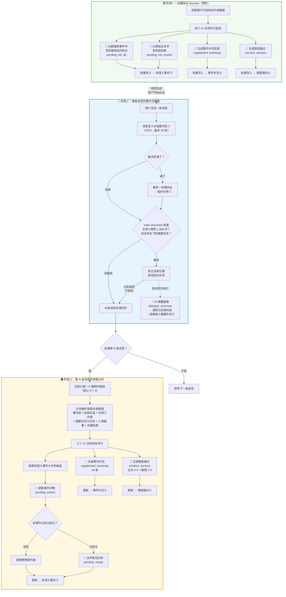
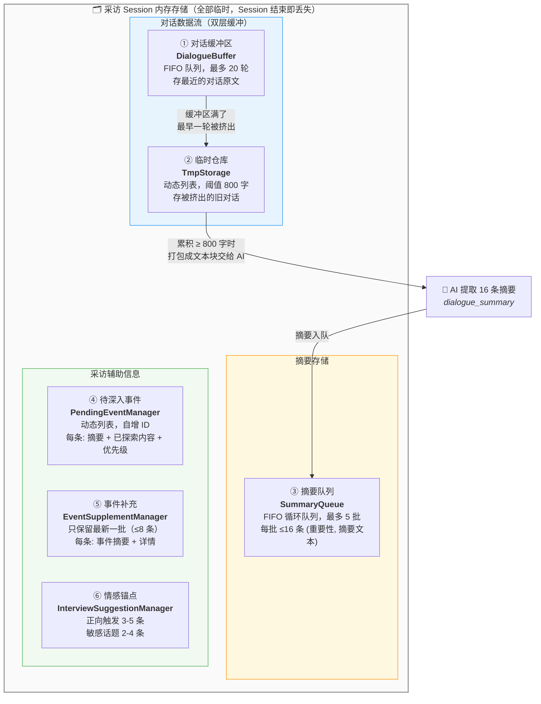
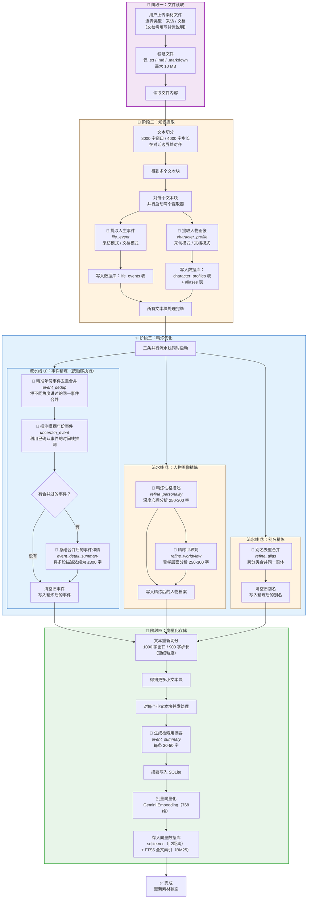
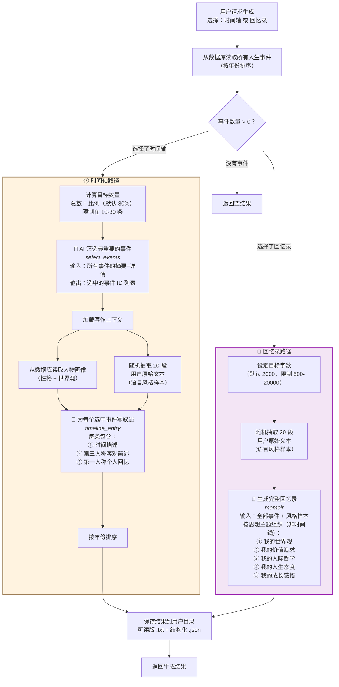
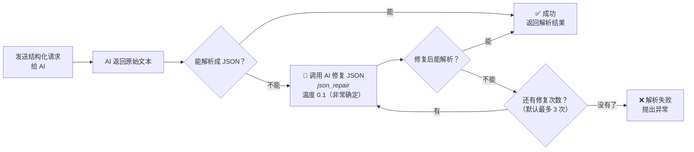

# 工作流与提示词指南

> 本文档帮助你理解系统的三个 AI 工作流是怎么运转的，以及每个 AI 调用的提示词在哪里、怎么改。

---

## 一、怎么看 AI 调用日志

每次 AI 被调用，系统都会自动在 `.log/API_calls/` 目录下写一个 `.txt` 文件，以人类可读的纯文本格式记录完整的问答内容。

打开任何一个日志文件，结构如下：

```
════════════════════════════════════════════════════════════
  #7  memoir  |  2026-02-24T14:00:37.682331
════════════════════════════════════════════════════════════
where:       MemoirGenerator.generate_memoir()
call_type:   structured
model:       deepseek-v3
key_index:   6
latency_s:   19.39
tokens:      None
resp_length: 1098

─── SYSTEM PROMPT ─────────────────────────────────────────

你是一位专业的传记作家...

─── USER PROMPT ──────────────────────────────────────────

【叙述者语言风格参考】
样本1：...

─── RESPONSE ─────────────────────────────────────────────

{ "memoir": "..." }

────────────────────────────────────────────────────────────
```

- **头部元数据** — `where`（调用来源）、`tag`（短名，和下文流程图标签对应）、`model`、`latency_s` 等
- **SYSTEM PROMPT** — 系统提示词，定义 AI 角色和规则
- **USER PROMPT** — 用户提示词，包含具体任务和数据
- **RESPONSE** — AI 返回的完整回答

> 如果你想看某次运行中 AI 到底说了什么，直接去 `.log/API_calls/` 找最新的文件夹，
> 文件名里的 tag 就是下面流程图中标注的名字。

---

## 二、采访工作流 (Interview)

采访工作流管理实时对话，有三个阶段：**创建 Session 时的预热**、**每条消息的缓冲与摘要**、**每 N 条消息的深度分析**。

### 完整流程图



### 阶段一：Session 预热的 AI 调用

用户刚进入采访页面，系统读取已有知识库，**四个 AI 任务并行**预生成采访辅助信息：

| 做什么                            | 日志标签               | 温度 | 提示词在哪                                                                                                              |
| --------------------------------- | ---------------------- | ---- | ----------------------------------------------------------------------------------------------------------------------- |
| 从数据库事件中找到可追问的点      | `pending_init_db`      | 0.3  | [`pending_event_initializer.py` 第 195-280 行](../src/application/interview/actuator/pending_event_initializer.py#L195) |
| 从原始文本中发现新线索            | `pending_init_chunks`  | 0.4  | [`pending_event_initializer.py` 第 349-451 行](../src/application/interview/actuator/pending_event_initializer.py#L349) |
| 生成初始事件补充信息              | `supplement_bootstrap` | 0.3  | [`supplement_extractor.py` 第 58-90 行](../src/application/interview/actuator/supplement_extractor.py#L58)              |
| 生成情感锚点（正向触发+敏感话题） | `emotion_anchors`      | 0.5  | [`supplement_extractor.py` 第 129-162 行](../src/application/interview/actuator/supplement_extractor.py#L129)           |

### 阶段二：消息处理的 AI 调用

每条消息经过**双层缓冲**（缓冲区 20 轮 → 临时仓库 800 字），由 mark-and-drain 异步触发摘要提取：

| 做什么                               | 日志标签           | 温度 | 提示词在哪                                                                                            |
| ------------------------------------ | ------------------ | ---- | ----------------------------------------------------------------------------------------------------- |
| 从对话文本块中提取 16 条重要信息摘要 | `dialogue_summary` | 0.3  | [`summary_processor.py` 第 81-123 行](../src/application/interview/actuator/summary_processor.py#L81) |

> **双层缓冲 + mark-and-drain 机制**：对话先进入缓冲区（最多 20 轮），满了最早一轮被挤到临时仓库。每条消息处理完后，系统检查临时仓库是否累积到 800 字。达到阈值且没有在飞的摘要任务时，标记当前位置、后台启动 AI 摘要提取。提取期间仓库仍可继续接收新内容。完成后删除标记前的已处理内容，将摘要推入队列，然后级联检查是否需要再次触发。

### 阶段三：N 轮刷新的 AI 调用

每收到第 N 条消息（默认 N=5），**三个 AI 任务并行**做深度分析：

| 做什么                                    | 日志标签               | 温度 | 提示词在哪                                                                                                          |
| ----------------------------------------- | ---------------------- | ---- | ------------------------------------------------------------------------------------------------------------------- |
| 生成/更新事件补充信息（≤8 条）            | `supplement_bootstrap` | 0.3  | [`supplement_extractor.py` 第 58-90 行](../src/application/interview/actuator/supplement_extractor.py#L58)          |
| 生成情感锚点（正向 3-5 条 + 敏感 2-4 条） | `emotion_anchors`      | 0.5  | [`supplement_extractor.py` 第 129-162 行](../src/application/interview/actuator/supplement_extractor.py#L129)       |
| 提取待深入事件的详情                      | `pending_extract`      | 0.2  | [`pending_event_processor.py` 第 87-123 行](../src/application/interview/actuator/pending_event_processor.py#L87)   |
| 合并同一事件的新旧分析内容                | `pending_merge`        | 0.1  | [`pending_event_processor.py` 第 341-378 行](../src/application/interview/actuator/pending_event_processor.py#L341) |

### 采访存储机制

采访过程中产生的所有数据都存在**内存**中（Session 结束即丢失），由 `DialogueStorage` 统一管理六个存储组件：



#### 六个存储组件详解

| # | 组件 | 数据结构 | 容量限制 | 写入时机 | 读取时机 |
|---|------|----------|----------|----------|----------|
| ① | **对话缓冲区** | FIFO 队列 (`deque`) | 最多 20 轮 | 每收到一条消息 | N 轮刷新时读取全部对话 |
| ② | **临时仓库** | 动态列表 + 字符计数器 | 800 字触发 mark-and-drain | 缓冲区挤出旧对话时 | mark-and-drain 异步摘要时 |
| ③ | **摘要队列** | FIFO 循环队列 | 最多 5 批 × 16 条 | AI 提取完毕后入队 | N 轮刷新时读取全部历史摘要 |
| ④ | **待深入事件** | 动态列表 + 自增 ID | 无上限 | 预热时批量添加；N 轮刷新时更新已探索内容 | N 轮刷新时读取；推送给前端 |
| ⑤ | **事件补充** | 列表（每次整体替换） | 最新一批 ≤8 条 | 预热 / N 轮刷新生成后替换 | 推送给前端 |
| ⑥ | **情感锚点** | 两个列表（每次整体替换） | 正向 3-5 + 敏感 2-4 | 预热 / N 轮刷新生成后替换 | 推送给前端 |

#### 对话双层缓冲详细说明

每条消息进入系统后的完整旅程：

1. **进入缓冲区**：消息被包装成 `DialogueTurn`（说话人 + 内容 + 时间戳），添加到缓冲区队列末尾
2. **挤出到临时仓库**：如果缓冲区已满（20 轮），最早一轮自动被挤出，进入临时仓库的列表
3. **mark-and-drain 检查**：每条消息后检查临时仓库是否累积 ≥ 800 字且无在飞摘要任务
4. **标记 → 提取 → 清除**：达到阈值时标记当前位置，后台将标记前的内容打包交给 AI 提取 16 条摘要。提取期间仓库可继续接收新内容。完成后清除已处理内容，结果推入摘要队列

> **flush 端点的行为**：`/session/{id}/flush` 触发一次 mark-and-drain 检查。如果临时仓库未达阈值，是静默空操作。

---

## 三、知识库工作流 (Knowledge)

用户上传素材文件后，系统经过四个阶段处理：**读取文件** → **并发提取知识** → **精炼优化** → **向量化存储**。

上传时用户选择**素材类型**：

- **采访记录**（interview）：格式为 `[Interviewer]: ... [用户名]: ...` 的对话，无需背景说明
- **普通文档**（document）：日记、回忆录、自传等，用户需要提供**背景说明**（说明文中人物关系等，注入系统提示词中帮助 AI 理解）

两种类型都使用 8000 字窗口 / 4000 字步长切分文本，但使用**不同的提示词模板**来引导 AI 提取。

### 完整流程图



### 阶段二：知识提取的 AI 调用

每个文本块同时调用两个提取器，根据素材类型自动切换提示词模板：

| 做什么                   | 日志标签            | 温度 | 提示词在哪                                                                                                                            |
| ------------------------ | ------------------- | ---- | ------------------------------------------------------------------------------------------------------------------------------------- |
| 提取人生事件（采访模式） | `life_event`        | 0.1  | [`life_event_extractor.py` 第 32-134 行](../src/application/knowledge/extraction/extractor/life_event_extractor.py#L32)               |
| 提取人生事件（文档模式） | `life_event`        | 0.1  | [`life_event_extractor.py` 第 136-192 行](../src/application/knowledge/extraction/extractor/life_event_extractor.py#L136)             |
| 提取人物画像（采访模式） | `character_profile` | 0.3  | [`character_profile_extractor.py` 第 24-87 行](../src/application/knowledge/extraction/extractor/character_profile_extractor.py#L24)  |
| 提取人物画像（文档模式） | `character_profile` | 0.3  | [`character_profile_extractor.py` 第 89-119 行](../src/application/knowledge/extraction/extractor/character_profile_extractor.py#L89) |

> **提示词模板切换**：`life_event` 和 `character_profile` 各有两套 user prompt（采访 / 文档），系统根据上传时的素材类型自动选择。如果用户填写了「背景说明」，内容会追加到 system prompt 末尾的 `[背景说明]` 段落，帮助 AI 理解文档中的人物关系。

### 阶段三：精炼优化的 AI 调用

三条流水线并行执行，其中事件精炼内部是顺序的（后一步依赖前一步结果）：

| 做什么                           | 日志标签               | 温度 | 流水线 | 提示词在哪                                                                                                                        |
| -------------------------------- | ---------------------- | ---- | ------ | --------------------------------------------------------------------------------------------------------------------------------- |
| 精准年份事件去重合并             | `event_dedup`          | 0.1  | ① 事件 | [`event_refiner.py` 第 13-97 行](../src/application/knowledge/refinement/refiner/event_refiner.py#L13)                            |
| 推测模糊年份（利用已确认时间线） | `uncertain_event`      | 0.2  | ① 事件 | [`uncertain_event_refiner.py` 第 13-94 行](../src/application/knowledge/refinement/refiner/uncertain_event_refiner.py#L13)        |
| 总结合并事件的详情（≤300 字）    | `event_detail_summary` | 0.1  | ① 事件 | [`event_details_refiner.py` 第 13-46 行](../src/application/knowledge/refinement/refiner/event_details_refiner.py#L13)            |
| 精炼性格描述（深度心理分析）     | `refine_personality`   | 0.1  | ② 画像 | [`character_profile_refiner.py` 第 13-58 行](../src/application/knowledge/refinement/refiner/character_profile_refiner.py#L13)    |
| 精炼世界观（哲学层面分析）       | `refine_worldview`     | 0.1  | ② 画像 | [`character_profile_refiner.py` 第 61-111 行](../src/application/knowledge/refinement/refiner/character_profile_refiner.py#L61)   |
| 别名去重合并（跨分类）           | `refine_alias`         | 0.1  | ③ 别名 | [`character_profile_refiner.py` 第 114-154 行](../src/application/knowledge/refinement/refiner/character_profile_refiner.py#L114) |

### 阶段四：向量化的 AI 调用

文本重新切成更小的块（1000 字窗口），为每块生成检索用摘要后向量化：

| 做什么                     | 日志标签        | 温度 | 提示词在哪                                                                                                                   |
| -------------------------- | --------------- | ---- | ---------------------------------------------------------------------------------------------------------------------------- |
| 为每个文本块生成检索用摘要 | `event_summary` | 0.3  | [`event_summary_extractor.py` 第 13-56 行](../src/application/knowledge/extraction/extractor/event_summary_extractor.py#L13) |

> **向量混合检索**：最终检索时使用 70% 向量相似度（Gemini 768 维 L2）+ 30% 全文匹配（BM25），综合得分 ≥ 0.5 才纳入结果。

---

## 四、生成工作流 (Generate)

从知识库读取所有事件，根据用户选择的模式走不同的生成路径：**时间轴**走"筛选 → 加载上下文 → 逐条写作"，**回忆录**走"准备风格样本 → 整篇写作"。

### 完整流程图



### 两条路径的关键区别

| 对比项             | 时间轴                        | 回忆录                |
| ------------------ | ----------------------------- | --------------------- |
| **使用哪些事件**   | AI 筛选后的一部分（10-30 条） | 全部事件              |
| **是否用人物画像** | 是（影响叙述风格）            | 否                    |
| **语言风格样本数** | 10 段（每段 ≤500 字）         | 20 段（每段 ≤400 字） |
| **AI 调用次数**    | 2 次（筛选 + 写作）           | 1 次（整篇生成）      |
| **叙述视角**       | 客观 + 第一人称混合           | 纯第一人称            |
| **组织方式**       | 按时间排序                    | 按思想主题组织        |

### 时间轴路径的 AI 调用

| 做什么                     | 日志标签         | 温度 | 提示词在哪                                                                                                |
| -------------------------- | ---------------- | ---- | --------------------------------------------------------------------------------------------------------- |
| 从全部事件中筛选最有意义的 | `select_events`  | 0.3  | [`timeline_generator.py` 第 68-99 行](../src/application/generate/generator/timeline_generator.py#L68)    |
| 为每个选中事件写时间轴叙述 | `timeline_entry` | 0.7  | [`timeline_generator.py` 第 161-217 行](../src/application/generate/generator/timeline_generator.py#L161) |

### 回忆录路径的 AI 调用

| 做什么                             | 日志标签 | 温度 | 提示词在哪                                                                                          |
| ---------------------------------- | -------- | ---- | --------------------------------------------------------------------------------------------------- |
| 生成以思想和哲学为核心的完整回忆录 | `memoir` | 0.7  | [`memoir_generator.py` 第 54-110 行](../src/application/generate/generator/memoir_generator.py#L54) |

> **语言风格样本**：系统从用户上传的原始文本中随机抽取片段，放入提示词让 AI 模仿说话风格。时间轴用 10 段（需要客观叙述），回忆录用 20 段（需要更深入的风格还原）。

---

## 五、JSON 自动修复机制

所有"结构化输出"类型的 AI 调用（即需要返回 JSON 的调用）都经过一个**自动修复管道**：



| 做什么                          | 日志标签      | 温度 | 提示词在哪                                                            |
| ------------------------------- | ------------- | ---- | --------------------------------------------------------------------- |
| 修复格式错误的 JSON（自动触发） | `json_repair` | 0.1  | [`json_parser.py` 第 75-91 行](../src/infra/utils/json_parser.py#L75) |

> 这个修复机制是**全局的**，知识库提取、采访分析、生成写作中的每一个需要 JSON 返回的 AI 调用，如果 AI 返回了格式错误的 JSON，都会自动触发修复。修复最多尝试 3 次，每次用上一次的修复结果继续修。

---

## 六、怎么改提示词

### 找到提示词

1. 上面每个表格的 **"提示词在哪"** 列就是文件路径和行号，直接点击即可跳转
2. 或者：先运行一次，到 `.log/API_calls/` 最新文件夹中找到对应 tag 的 `.txt` 文件，打开看 `SYSTEM PROMPT` 和 `USER PROMPT` 段落，就是当时发给 AI 的完整内容

### 修改提示词

提示词通常写在两个位置：

- **system prompt**（系统提示）：定义 AI 的角色和规则，比如"你是一位传记作家"
- **user prompt**（用户提示）：给 AI 的具体任务和数据，比如"请分析以下对话内容：..."

打开对应文件，找到行号范围内的中文文本，直接修改即可。修改后重启后端即可生效。

> **注意**：知识库提取的 `life_event` 和 `character_profile` 各有两套 user prompt 模板（采访模式 / 文档模式），
> 系统根据上传时选择的素材类型自动切换。如果用户上传时填写了「背景说明」，内容会追加到 system prompt 末尾作为
> `[背景说明]` 段落，帮助 AI 理解文档中的人物关系。

### 调整 AI 的创意程度

每个调用都有一个"温度"参数（temperature），决定 AI 回答的随机性：

| 温度    | 效果                 | 用在哪                   |
| ------- | -------------------- | ------------------------ |
| 0.1     | 非常确定，尽量不发挥 | 去重、合并、修复、精炼   |
| 0.2-0.3 | 适度确定，结构化输出 | 事件提取、信息筛选、摘要 |
| 0.4-0.5 | 有一定灵活度         | 情感分析、线索发现       |
| 0.7     | 比较有创意           | 回忆录、时间轴写作       |

温度参数在提示词附近的代码中（通常是 `temperature=0.3` 这样的写法），直接改数字就行。

---

## 七、全部 AI 调用一览

共 20 个调用点（含 JSON 修复），按模块分配 4 种模型角色：

**模型配置**（在 `.env` 中设置，详见 `.env.example`）：

| 环境变量 | 默认值 | 角色 |
| --- | --- | --- |
| `LLM_CONVERSATION_MODEL` | `deepseek/deepseek-v3.2-251201` | 采访实时分析 |
| `LLM_EXTRACTION_MODEL` | `deepseek/deepseek-v3.2-251201` | 知识库提取+精炼 |
| `LLM_CREATIVE_MODEL` | `claude-3.7-sonnet` | 回忆录+时间轴写作 |
| `LLM_UTILITY_MODEL` | `deepseek/deepseek-v3.2-251201` | JSON修复等机械任务 |

**全部调用点**：

| 日志标签               | 功能                          | 温度 | 模型角色     | 所属工作流 | 提示词文件                                                                                                               |
| ---------------------- | ----------------------------- | ---- | ------------ | ---------- | ------------------------------------------------------------------------------------------------------------------------ |
| `dialogue_summary`     | 对话摘要提取                  | 0.3  | conversation | 采访       | [`summary_processor.py`](../src/application/interview/actuator/summary_processor.py#L81)                                 |
| `supplement_bootstrap` | 事件补充信息生成              | 0.3  | conversation | 采访       | [`supplement_extractor.py`](../src/application/interview/actuator/supplement_extractor.py#L58)                           |
| `emotion_anchors`      | 情感锚点生成                  | 0.5  | conversation | 采访       | [`supplement_extractor.py`](../src/application/interview/actuator/supplement_extractor.py#L129)                          |
| `pending_init_db`      | 从数据库事件找追问点          | 0.3  | conversation | 采访       | [`pending_event_initializer.py`](../src/application/interview/actuator/pending_event_initializer.py#L195)                |
| `pending_init_chunks`  | 从文本中找新线索              | 0.4  | conversation | 采访       | [`pending_event_initializer.py`](../src/application/interview/actuator/pending_event_initializer.py#L349)                |
| `pending_extract`      | 探索事件详情                  | 0.2  | conversation | 采访       | [`pending_event_processor.py`](../src/application/interview/actuator/pending_event_processor.py#L87)                     |
| `pending_merge`        | 合并事件分析                  | 0.1  | **utility**  | 采访       | [`pending_event_processor.py`](../src/application/interview/actuator/pending_event_processor.py#L341)                    |
| `life_event`           | 人生事件提取（采访/文档两套） | 0.1  | extraction   | 知识库     | [`life_event_extractor.py`](../src/application/knowledge/extraction/extractor/life_event_extractor.py#L32)               |
| `character_profile`    | 人物画像提取（采访/文档两套） | 0.3  | extraction   | 知识库     | [`character_profile_extractor.py`](../src/application/knowledge/extraction/extractor/character_profile_extractor.py#L24) |
| `event_summary`        | 事件摘要（向量化用）          | 0.3  | extraction   | 知识库     | [`event_summary_extractor.py`](../src/application/knowledge/extraction/extractor/event_summary_extractor.py#L13)         |
| `event_dedup`          | 事件去重合并                  | 0.1  | extraction   | 知识库     | [`event_refiner.py`](../src/application/knowledge/refinement/refiner/event_refiner.py#L13)                               |
| `uncertain_event`      | 年份推测                      | 0.2  | extraction   | 知识库     | [`uncertain_event_refiner.py`](../src/application/knowledge/refinement/refiner/uncertain_event_refiner.py#L13)           |
| `event_detail_summary` | 事件详情总结                  | 0.1  | **utility**  | 知识库     | [`event_details_refiner.py`](../src/application/knowledge/refinement/refiner/event_details_refiner.py#L13)               |
| `refine_personality`   | 性格精炼                      | 0.1  | extraction   | 知识库     | [`character_profile_refiner.py`](../src/application/knowledge/refinement/refiner/character_profile_refiner.py#L13)       |
| `refine_worldview`     | 世界观精炼                    | 0.1  | extraction   | 知识库     | [`character_profile_refiner.py`](../src/application/knowledge/refinement/refiner/character_profile_refiner.py#L61)       |
| `refine_alias`         | 别名精炼                      | 0.1  | **utility**  | 知识库     | [`character_profile_refiner.py`](../src/application/knowledge/refinement/refiner/character_profile_refiner.py#L114)      |
| `select_events`        | 筛选重要事件                  | 0.3  | **creative** | 生成       | [`timeline_generator.py`](../src/application/generate/generator/timeline_generator.py#L68)                               |
| `timeline_entry`       | 时间轴叙述写作                | 0.7  | **creative** | 生成       | [`timeline_generator.py`](../src/application/generate/generator/timeline_generator.py#L161)                              |
| `memoir`               | 回忆录写作                    | 0.7  | **creative** | 生成       | [`memoir_generator.py`](../src/application/generate/generator/memoir_generator.py#L54)                                   |
| `json_repair`          | JSON 格式修复（全局自动触发） | 0.1  | **utility**  | 基础设施   | [`json_parser.py`](../src/infra/utils/json_parser.py#L75)                                                                |
